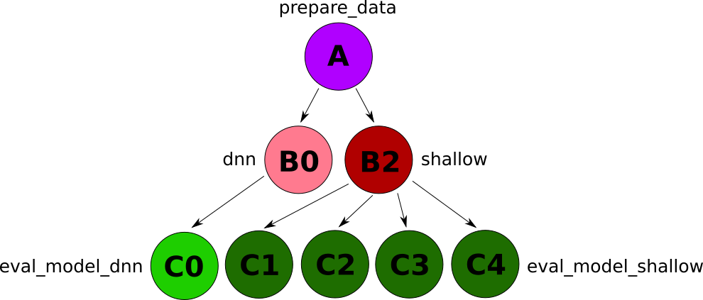

# Dataset preparation (if not using AEOLUS dataset provided)

## Import CSV file with reports
To run the nsides back-end framework on a custom dataset, first make a CSV file with the following fields:
`drug_concept_id, outcome_concept_id, report_id`
Drugs and outcomes do not need to use any specific vocabulary.

Next, run `python import_custom_data.py --data yourdata.csv`

This creates the following files: `drugmap.npy`, `alldrugstrings.npy`, `allreports.npy`, `outcomemap.npy`, `alloutcomestrings.npy`

## Build feature matrix
To build the drug and outcome feature matrices, run:
`python build_drugs.py`
`python build_outcomes.py`
`python combine_matrices.py`

The result should be 2 files: `CUSTOM_all_reports_outcomes.npy` and `CUSTOM_all_reports.npy` which will be used for submitting jobs.

# Submission of condor jobs to Open Science Grid

## How to submit jobs

Make the submission tarball and DAG runners:
1. `mkdir data; cd data`
2. `python ../get_data.py`
3. `cd ..`
4. `source make_nsides_tarball.sh`
5. `source make_workflows.sh`
6. `source make_nsides_tarball_lrc.sh`
7. `source make_workflows_LRonly.sh`

To submit a DNN job to a **CPU** node:
`condor_submit_dag workflowdir/workflow_0.dag`

To submit a DNN job to a **GPU** node:
`condor_submit_dag workflowdir_gpu/workflow_0.dag`

To submit an logistic regression job:
`condor_submit_dag workflowdir_LRonly/workflow_0.dag`

*Please note that logistic regression jobs should only be submitted to **CPU** nodes, as they do not take advantage of GPU.*

## DAG Workflow

## Script Summary
The scripts in this folder accomplish the following workflow:

1. Obtains the data from the OSG Stash using HTTP. `get_data.py`
2. Prepares the drug outcome data for input to the model generator.
  * `prepare_data_osg.py` aggregates all reports and outcomes, used for forming model
3. Run the models.  The output should be each report and the model score.
  * `mlp_dnn_streaming.py` runs the deep neural network multilayer perceptron
  * `mlp_shallow_osg.py` runs shallow classifiers including scikit-learn to run AdaBoost, RandomForest and Logistic Regression
4. Evaluate a given model model by calculating propensity score adjusted proportional reporting ratios (PRRs) for each reaction. `eval_model.py`

## Example Local Workflow

An example local workflow on OSG follows:
1. `git clone http://github.com/tatonett-lab/nsides nsides`
2. `cd nsides/condor`
3. `mkdir data; cd data; python ../get_data.py; cd ..`
4. Start tensorflow singularity shell: `singularity shell docker://tensorflow/tensorflow:latest`
5. Install dependencies:
 * `/usr/local/bin/pip install --user h5py`
 * `/usr/local/bin/pip install --user keras`
 * `/usr/local/bin/pip install --user wget`
6. `mkdir data; cd data; python ../get_data.py; cd ..`
7. `python prepare_data_osg.py --model-number 0`
8. `python mlp_dnn_streaming.py --run-on-cpu --suffix 0`
9. `python mlp_shallow_osg.py --suffix 0`
10. `python eval_model.py --model-type bdt --model-number 0`
11. `python eval_model.py --model-type rfc --model-number 0`
12. `python eval_model.py --model-type lrc --model-number 0`
13. `python eval_model.py --model-type dnn --model-number 0`
14. `python eval_model.py --model-type nopsm --model-number 0`

- - -

# Submission of jobs to the Habanero supercomputing cluster

There are two major differences between OSG and Habanero:

1. Habanero uses the SLURM job runner instead of Condor. SLURM has a more self-contained documentation style, and all necessary options for running a batch of jobs can be packaged into a single shell script.

2. SLURM modifies files entirely within the current working directory (instead of in a separate VM). This means you don't have to worry about sending data to or retrieving data from individual VMs, but you have the extra headache of making sure the intermediate and output files of each job are isolated in ways that don't cause issues down the line (e.g., so that when one job finishes you don't accidentally modify or trash files in use by another job).

The implications of these two facts are accounted for in the job runner script. Use it as follows:

`$ sbatch --array=0-150 nsides_habanero_slurm.sh`

This will queue 150 jobs, one corresponding to each of `--model-number` 1 through 150 (as used in the python scripts in this folder). At the end of each batch, the bash script will package the results and send them to `/rigel/fcs/projects/nsides_results/results_N_gpu.tar.gz`, where `N` is the number of the corresponding job.
